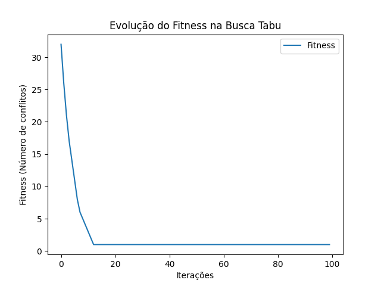

# Busca Tabu
## Aplicada ao problema de N rainhas

A busca tabu é uma meta-heurı́stica para problemas de otimização combinatória, usada para escapar de ótimos locais ao permitir movimentos ”proibidos”de forma controlada.
No problema das N rainhas, o objetivo é posicionar N rainhas em um tabuleiro N x N sem conflitos. O algoritmo começa calculando um vetor de solução aleatória e calcula o fitness
dessa solução. Após isso, ele gera uma solução vizinha e calcula também o fitness dessa nova solução. Compara o fitness da nova solução com a antiga e o que for menor, é
assumido como melhor solução. O processo se repete até que seja encontrado um fitness igual a zero ou o número máximo de iterações pré definidas se exceder.

### Definição do problema

Para avaliação do Busca tabu aplicado ao problema de N-rainhas foi utilizado o problema formulado conforme visto na Equação 1 com as caracterı́sticas de minimizar os conflitos
entre as rainhas.

$f(x) = \sum_{i=1}^{N} \sum_{j=1, j \neq i}^{N} Conf(x_i, x_j)$
onde $Conf(x_i, x_j)$ = 1 se $x_i$ e $x_j$ estão em confilito e 0 caso contrário.

### Parametrização

Foram realizados testes variando-se, vez a vez, cada um dos parâmetros para se observar comportamentos como tempo de execução e fitness final encontrado. Após testes, a parametrização utilizada foi a seguinte:
• Número de rainhas: 100
• Tamanho da lista tabu: 8
• Número máximo de iterações: 1000

### Resultados

Conforme mostrado na Figura 1, os resultados indicam uma convergência do algoritmo ao longo de 5000 iterações para uma configuração sem conflitos ou com o menor número de conflitos possı́vel.

